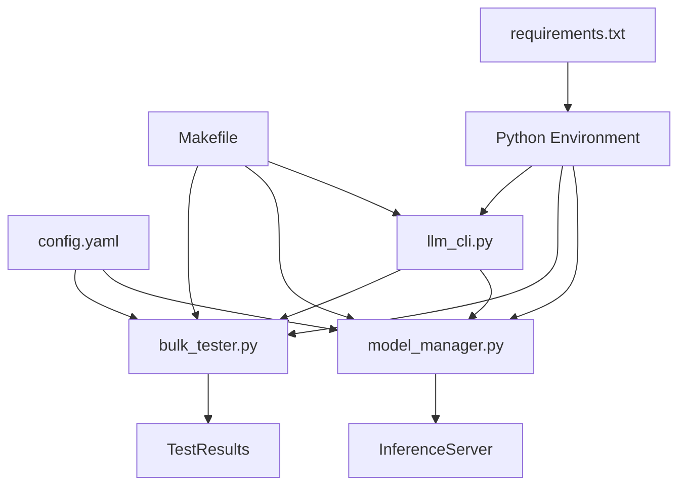

# 📁 Complete Multi-LLM Testing Pipeline File Structure

## Required Files and Directories

```
llm-testing-pipeline/
│
├── 🐍 Core Python Modules (REQUIRED)
│   ├── model_manager.py         # Model loading, switching, and server management
│   ├── bulk_tester.py          # Automated testing across models and datasets
│   └── llm_cli.py              # Command-line interface for all operations
│
├── ⚙️ Configuration Files (REQUIRED)
│   ├── config.yaml             # Central configuration for models, datasets, server
│   ├── requirements.txt        # Python package dependencies
│   └── Makefile                # One-command operations
│
├── 🚀 Setup Scripts (REQUIRED)
│   ├── quick_setup.sh          # Automated environment setup
│   ├── validate_setup.py       # System validation script
│   └── fix_encoding.py         # Fix character encoding issues
│
├── 📚 Documentation (REQUIRED)
│   ├── README.md               # Main documentation
│   ├── PROJECT_STRUCTURE.md   # This file - project structure guide
│   └── SETUP_CHECKLIST.md      # Setup validation checklist
│
├── 📂 Data Directories (AUTO-CREATED)
│   ├── results/                # Test results and reports
│   │   ├── benchmark_summary_*.csv
│   │   ├── report_*.html
│   │   └── {model}_{dataset}_{timestamp}.json
│   │
│   ├── dataset_cache/          # Cached datasets for faster loading
│   │   └── cache_{dataset}_{subset}_{samples}.json
│   │
│   ├── sampled_datasets/       # Pre-sampled dataset files
│   │   └── {dataset}_sampled.json
│   │
│   └── logs/                   # Application logs
│       ├── inference.log
│       └── server.log
│
├── 🔧 Optional Enhancement Files
│   ├── dataset_processor.py    # Enhanced dataset processing (from original)
│   ├── dataset_sampler.py      # Dataset sampling utilities (from original)
│   └── dataset_loader.py       # Dataset loading hooks (from original)
│
└── 🐳 Optional Docker Files
    ├── Dockerfile              # Docker container definition
    ├── docker-compose.yml      # Docker compose configuration
    └── .dockerignore          # Docker ignore patterns
```

## File Descriptions and Purposes

### Core Python Modules (Required)

#### `model_manager.py`
- **Purpose**: Manages multiple LLM models with hot-swapping capability
- **Key Classes**: 
  - `ModelManager`: Handles model loading/unloading
  - `InferenceServer`: FastAPI server for inference
- **Functions**:
  - Load/unload models dynamically
  - Manage GPU memory
  - Provide inference endpoints

#### `bulk_tester.py`
- **Purpose**: Automated testing across multiple models and datasets
- **Key Classes**:
  - `BulkTester`: Main testing orchestrator
- **Functions**:
  - Run benchmarks on multiple models
  - Generate comparison reports
  - Create HTML dashboards
  - Calculate metrics (accuracy, latency)

#### `llm_cli.py`
- **Purpose**: User-friendly command-line interface
- **Key Classes**:
  - `LLMTestingCLI`: CLI controller
- **Functions**:
  - Start/stop server
  - List models and datasets
  - Show results
  - Generate configurations

### Configuration Files (Required)

#### `config.yaml`
```yaml
# Must contain these sections:
models:           # Model configurations
  model_name:
    path: "..."
    type: "..."
    tensor_parallel_size: N
    
datasets:         # Dataset test suites
  suite_name:
    - name: "..."
      samples: N
      
server:           # Server settings
  host: "0.0.0.0"
  port: 8000
  batch_size: 32
  
inference:        # Inference settings
  output_dir: "results"
  use_sampled_data: true
```

#### `requirements.txt`
```txt
# Minimum required packages:
torch>=2.5.0
transformers>=4.46.0
vllm>=0.6.4
fastapi>=0.115.0
uvicorn[standard]>=0.32.0
promptbench>=0.0.4
datasets>=2.19.0
pandas>=1.3.5
numpy>=1.26.0
pyyaml>=6.0.0
requests>=2.32.0
tqdm>=4.66.0
click>=8.0.0
rich>=13.0.0
```

#### `Makefile`
```makefile
# Must include these targets:
help            # Show help
setup           # Initial setup
quick           # Quick test
full            # Full benchmark
server          # Start server
stop            # Stop server
status          # Check status
results         # Show results
dashboard       # Open dashboard
clean           # Clean files
```

## Directory Structure Details

### `results/` Directory
- **Purpose**: Store all test outputs
- **Contents**:
  - `benchmark_summary_{timestamp}.csv` - Summary statistics
  - `report_{timestamp}.html` - HTML dashboard
  - `{model}_{dataset}_{timestamp}.json` - Detailed results
  - `cache_*.json` - Cached dataset samples

### `dataset_cache/` Directory
- **Purpose**: Cache datasets for faster repeated testing
- **Contents**:
  - Cached dataset files in JSON format
  - Named: `cache_{dataset}_{subset}_{samples}.json`

### `sampled_datasets/` Directory
- **Purpose**: Pre-sampled datasets for quick testing
- **Contents**:
  - Sampled data files
  - Named: `{dataset}_sampled.json`

### `logs/` Directory
- **Purpose**: Application and server logs
- **Contents**:
  - `inference.log` - Testing logs
  - `server.log` - Server output
  - Error logs and debug information

## File Dependencies Graph



## Minimal Working Set

For a minimal working system, you MUST have:

```
llm-testing-pipeline/
├── model_manager.py      ✅
├── bulk_tester.py        ✅
├── llm_cli.py           ✅
├── config.yaml          ✅
├── requirements.txt     ✅
├── Makefile            ✅
├── results/            📁
├── dataset_cache/      📁
└── sampled_datasets/   📁
```

## Setup Verification Commands

```bash
# Check if all required files exist
ls -la model_manager.py bulk_tester.py llm_cli.py config.yaml Makefile

# Check if directories exist
ls -la results/ dataset_cache/ sampled_datasets/ logs/

# Verify Python modules can be imported
python -c "import model_manager, bulk_tester, llm_cli; print('✓ All modules OK')"

# Check configuration
python -c "import yaml; yaml.safe_load(open('config.yaml')); print('✓ Config OK')"

# Test server startup
python model_manager.py --list
```

## File Size Expectations

| File | Expected Size | Notes |
|------|--------------|-------|
| model_manager.py | 8-10 KB | Core model management |
| bulk_tester.py | 12-15 KB | Testing logic |
| llm_cli.py | 10-12 KB | CLI interface |
| config.yaml | 2-3 KB | Configuration |
| Makefile | 5-7 KB | Commands |
| requirements.txt | 1 KB | Dependencies |

## Environment Variables

Create `.env` file (optional):
```bash
# GPU Settings
CUDA_VISIBLE_DEVICES=0,1,2,3,4,5,6,7
PYTORCH_CUDA_ALLOC_CONF=max_split_size_mb:512

# Server Settings
LLM_SERVER_PORT=8000
LLM_SERVER_HOST=0.0.0.0

# Performance
TOKENIZERS_PARALLELISM=false
OMP_NUM_THREADS=1
```

## Git Ignore Recommendations

Create `.gitignore`:
```
# Python
__pycache__/
*.py[cod]
*$py.class
*.so

# Data directories
results/
dataset_cache/
sampled_datasets/
logs/

# Environment
.env
.venv/
venv/
ENV/

# IDE
.vscode/
.idea/
*.swp
*.swo

# OS
.DS_Store
Thumbs.db

# Models (too large)
models/
*.bin
*.safetensors
*.pth
```

## Quick Validation Script

Save as `check_structure.sh`:
```bash
#!/bin/bash
echo "Checking project structure..."

# Required files
files=(
    "model_manager.py"
    "bulk_tester.py"
    "llm_cli.py"
    "config.yaml"
    "requirements.txt"
    "Makefile"
)

# Required directories
dirs=(
    "results"
    "dataset_cache"
    "sampled_datasets"
    "logs"
)

all_good=true

for file in "${files[@]}"; do
    if [ -f "$file" ]; then
        echo "✓ $file"
    else
        echo "✗ $file MISSING"
        all_good=false
    fi
done

for dir in "${dirs[@]}"; do
    if [ -d "$dir" ]; then
        echo "✓ $dir/"
    else
        echo "✗ $dir/ MISSING"
        all_good=false
    fi
done

if $all_good; then
    echo "✓ All required files and directories present!"
    exit 0
else
    echo "✗ Some files/directories are missing!"
    exit 1
fi
```

## Success Indicators

Your setup is complete when:
1. ✅ All required files exist with correct names
2. ✅ All directories are created
3. ✅ Dependencies installed (`pip list | grep vllm`)
4. ✅ `make status` shows no errors
5. ✅ `python validate_setup.py` passes all checks
6. ✅ Server starts with `make server`
7. ✅ Quick test runs with `make quick`